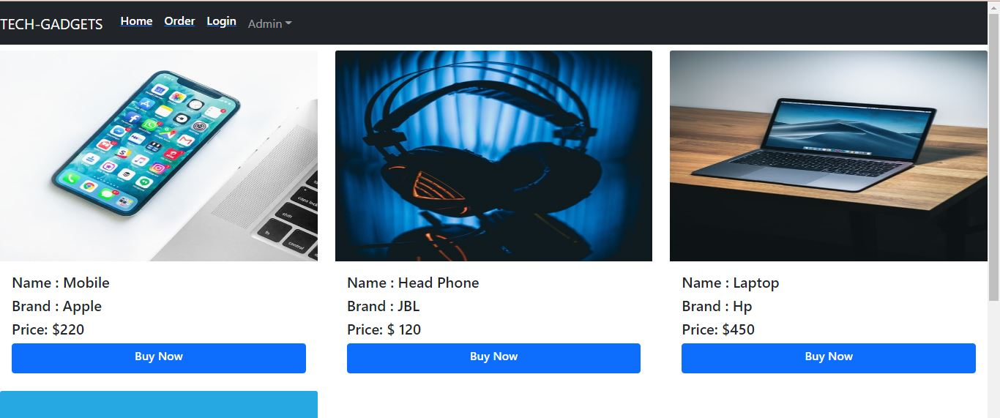
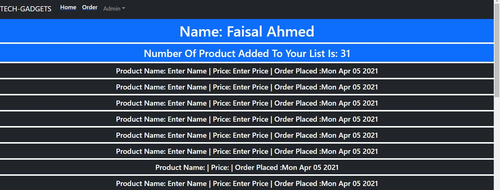
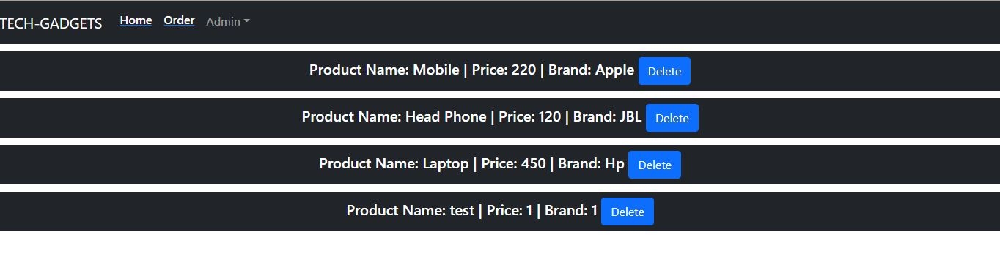

 Tech-Gadgets is a e-commerce based web appliction. Users can buy tech based gadgets from this application. User have to login with gmail to buy products. This application is created by using MERN stack. Firebase authentication is used along with private route. Users can add and delete products from the application as well as from the database. Application will provide the user the date of order being placed. Separate order list for separate login users along with in which date order placed. Here is the live site link: https://tech-gadgets-46624.web.app/

